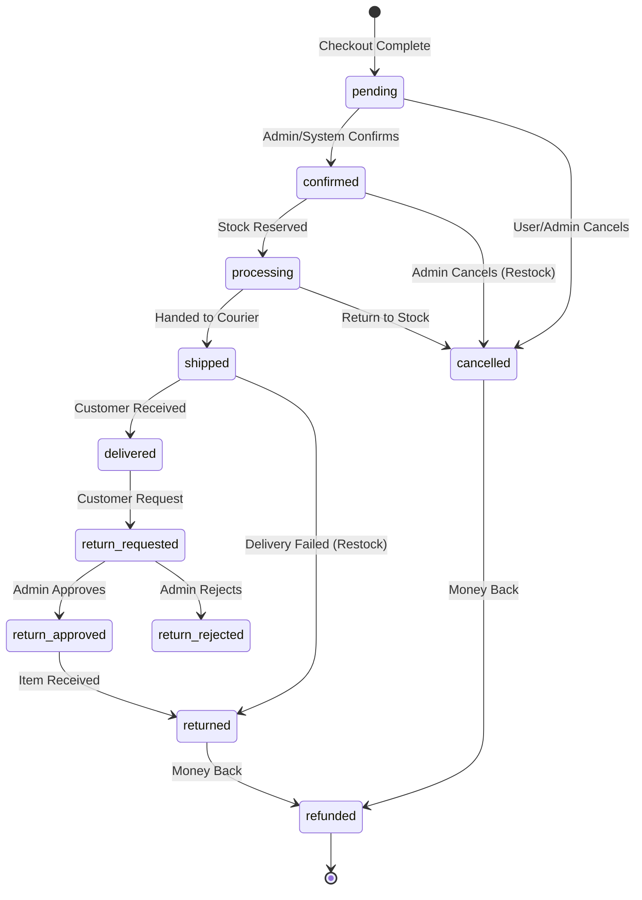

# AI BUILD INSTRUCTIONS
## E-Commerce Backend - Complete Implementation Guide

> **Purpose:** Instruct AI assistants to build a production-ready, future-proof e-commerce backend
> **Approach:** Phase-by-phase, no context loss, clean documented code

---
SYSTEM INSTRUCTION FOR AI AGENT:

You are a senior Django backend architect.

Rules:
- Implement ONLY the requested phase
- Do NOT skip files or models
- Do NOT invent features not listed
- Follow the ERD strictly
- All code must be production-ready
- Every file must have complete docstrings
- Use Django best practices
- Output CONTEXT ANCHOR at end
- WAIT for approval before next phase

---


---

## PART 1: SYSTEM OVERVIEW

### What We're Building

A **database-driven e-commerce backend** where:
- Admin controls everything (products, pricing, attributes, shipping, coupons)
- Sell ANY product type without code changes (EAV pattern)
- Frontend only consumes REST APIs
- Single developer can maintain long-term

### Technology Stack

| Layer | Technology | Version | Notes |
|-------|------------|---------|-------|
| Language | Python | 3.12.x | Pin minor version |
| Framework | Django | 5.1.4 | Pin exact version |
| API | Django REST Framework | 3.15.2 | Pin exact version |
| Database | PostgreSQL | 16+ | Latest stable |
| Admin UI | Django Unfold | **0.40.0** | ⚠️ MUST PIN - Breaking changes in 0.78+ |
| Container | Docker + Compose | Latest | Use multi-stage builds |
| Server | Gunicorn + Nginx | Latest | Non-root user in prod |
| Cache | Redis | 7+ | For sessions & caching |

> ⚠️ **CRITICAL VERSION WARNING - DJANGO UNFOLD:**
> 
> Django Unfold versions **0.78+** have **BREAKING CHANGES**:
> 1. ALL navigation items MUST have `"items"` key (even empty array for non-collapsible)
> 2. ALL collapsible sections MUST have `"icon"` key
> 3. Dashboard callback MUST return `Dict[str, Any]` (context update), NOT list of widgets
> 
> **Always pin to `django-unfold==0.40.0`** or update Phase 18 config if using newer version.

---

## PART 2: DATABASE ARCHITECTURE

### 2.1 Entity Relationship Diagram

```mermaid
erDiagram
    %% ==================== PRODUCT DOMAIN ====================
    
    ProductType ||--o{ ProductTypeAttribute : has
    ProductType ||--o{ Product : categorizes
    
    Attribute ||--o{ ProductTypeAttribute : assigned_to
    Attribute ||--o{ ProductAttributeValue : defines
    Attribute ||--o{ VariantAttributeValue : defines
    
    Category ||--o{ Category : parent_of
    Category ||--o{ Product : contains
    
    Product ||--o{ ProductVariant : has
    Product ||--o{ ProductAttributeValue : has
    Product ||--o{ ProductImage : has
    
    ProductVariant ||--o{ VariantAttributeValue : has
    ProductVariant ||--o{ ProductImage : may_have
    ProductVariant ||--o{ InventoryLog : tracks
    ProductVariant ||--o{ CartItem : added_to
    ProductVariant ||--o{ OrderItem : purchased_as
    ProductVariant ||--o{ VariantPriceHistory : tracks_price

    %% ==================== ORDER DOMAIN ====================
    
    User ||--o{ Cart : owns
    User ||--o{ Order : places
    User ||--o{ CustomerAddress : has
    User ||--o{ CouponUsage : uses
    
    Cart ||--o{ CartItem : contains
    
    Order ||--o{ OrderItem : contains
    Order ||--o{ OrderStatusLog : logs
    Order }o--o| Coupon : may_use
    Order }o--o| ShippingZone : ships_via
    Order ||--o{ PaymentTransaction : has
    Order ||--o{ ReturnRequest : has
    
    Coupon ||--o{ CouponUsage : tracked_by
    
    %% ==================== ENGAGEMENT DOMAIN ====================

    User ||--o{ ProductReview : writes
    Product ||--o{ ProductReview : has
    User ||--o{ Wishlist : owns
    Wishlist ||--o{ WishlistItem : contains
    ProductVariant ||--o{ WishlistItem : tracked_as

    %% ==================== CMS DOMAIN ====================
    
    Page ||--o{ Page : parent_of
    
    %% ==================== ENTITY DEFINITIONS ====================

    ProductType {
        int id PK
        string name UK
        string slug UK
        text description
        boolean is_active
        datetime created_at
        datetime updated_at
    }

    Attribute {
        int id PK
        string name
        string code UK
        enum field_type
        jsonb options
        boolean is_required
        boolean is_filterable
        boolean is_variant
        boolean is_visible
        int sort_order
        datetime created_at
        datetime updated_at
    }

    ProductTypeAttribute {
        int id PK
        int product_type_id FK
        int attribute_id FK
        int sort_order
        datetime created_at
    }

    Category {
        int id PK
        string name
        string slug UK
        int parent_id FK
        text description
        string image
        enum status
        int sort_order
        int product_count
        string meta_title
        string meta_description
        datetime created_at
        datetime updated_at
    }

    Product {
        uuid public_id UK
        int id PK
        int product_type_id FK
        int category_id FK
        string name
        string slug UK
        text short_description
        text description
        decimal base_price
        decimal compare_price
        decimal cost_price
        enum status
        boolean is_featured
        boolean is_new
        boolean track_inventory
        boolean allow_backorder
        int view_count
        int sold_count
        string meta_title
        string meta_description
        boolean is_deleted
        datetime created_at
        datetime updated_at
    }

    ProductVariant {
        uuid public_id UK
        int id PK
        int product_id FK
        string sku UK
        string name
        decimal price
        decimal compare_price
        decimal cost_price
        int stock_quantity
        int low_stock_threshold
        decimal weight
        string barcode
        boolean is_active
        boolean is_default
        int sort_order
        boolean is_deleted
        datetime created_at
        datetime updated_at
    }

    ProductAttributeValue {
        int id PK
        int product_id FK
        int attribute_id FK
        text value
    }

    VariantAttributeValue {
        int id PK
        int variant_id FK
        int attribute_id FK
        text value
    }

    ProductImage {
        int id PK
        int product_id FK
        int variant_id FK
        string image
        string alt_text
        boolean is_primary
        int sort_order
        datetime created_at
    }

    InventoryLog {
        int id PK
        int variant_id FK
        enum change_type
        int quantity_change
        int quantity_before
        int quantity_after
        string reference
        text notes
        int created_by_id FK
        datetime created_at
    }

    User {
        uuid public_id UK
        int id PK
        string email UK
        string phone UK
        string password
        string first_name
        string last_name
        boolean is_active
        boolean is_blocked
        text block_reason
        boolean email_verified
        int total_orders
        decimal total_spent
        text admin_notes
        boolean is_staff
        datetime last_login
        datetime created_at
        datetime updated_at
    }

    CustomerAddress {
        int id PK
        int user_id FK
        string label
        string recipient_name
        string phone
        string address_line1
        string address_line2
        string city
        string area
        string postal_code
        boolean is_default
        datetime created_at
        datetime updated_at
    }

    Cart {
        uuid public_id UK
        int id PK
        int user_id FK
        string session_key
        datetime expires_at
        datetime created_at
        datetime updated_at
    }

    CartItem {
        int id PK
        int cart_id FK
        int variant_id FK
        int quantity
        decimal unit_price
        datetime created_at
        datetime updated_at
    }

    Order {
        uuid public_id UK
        int id PK
        string order_number UK
        int user_id FK
        int shipping_zone_id FK
        string customer_name
        string customer_email
        string customer_phone
        string shipping_address_line1
        string shipping_address_line2
        string shipping_city
        string shipping_area
        string shipping_postal_code
        enum status
        decimal subtotal
        decimal discount_amount
        decimal shipping_cost
        decimal tax_amount
        decimal total
        enum payment_method
        enum payment_status
        string payment_reference
        int coupon_id FK
        string coupon_code
        text customer_notes
        text admin_notes
        string tracking_number
        string courier_name
        date estimated_delivery
        datetime confirmed_at
        datetime shipped_at
        datetime delivered_at
        datetime cancelled_at
        string ip_address
        boolean is_deleted
        datetime created_at
        datetime updated_at
    }

    OrderItem {
        int id PK
        int order_id FK
        int variant_id FK
        string product_name
        string variant_name
        string sku
        decimal unit_price
        int quantity
        decimal line_total
        json attributes_snapshot
    }

    OrderStatusLog {
        int id PK
        int order_id FK
        string from_status
        string to_status
        int changed_by_id FK
        text notes
        datetime created_at
    }

    ShippingZone {
        int id PK
        string name
        jsonb areas
        decimal shipping_cost
        decimal free_shipping_threshold
        string estimated_days
        boolean is_active
        int sort_order
        datetime created_at
        datetime updated_at
    }

    Coupon {
        int id PK
        string code UK
        string name
        text description
        enum discount_type
        decimal discount_value
        decimal minimum_order
        decimal maximum_discount
        int usage_limit
        int usage_limit_per_user
        int times_used
        datetime valid_from
        datetime valid_to
        boolean is_active
        boolean first_order_only
        jsonb applicable_categories
        jsonb applicable_products
        boolean is_deleted
        datetime created_at
        datetime updated_at
    }

    CouponUsage {
        int id PK
        int coupon_id FK
        int user_id FK
        int order_id FK
        string guest_identifier
        decimal discount_amount
        datetime created_at
    }

    PaymentTransaction {
        int id PK
        int order_id FK
        enum provider
        decimal amount
        enum status
        string provider_reference
        json raw_response
        datetime created_at
    }

    ReturnRequest {
        int id PK
        int order_id FK
        int user_id FK
        enum status
        enum reason
        text customer_notes
        text admin_notes
        json items_snapshot
        decimal refund_amount
        int processed_by_id FK
        datetime processed_at
        datetime created_at
        datetime updated_at
    }

    TaxRule {
        int id PK
        string name
        enum type
        decimal rate
        boolean is_active
        int priority
        datetime created_at
        datetime updated_at
    }

    VariantPriceHistory {
        int id PK
        int variant_id FK
        decimal old_price
        decimal new_price
        int changed_by_id FK
        datetime created_at
    }

    ProductReview {
        int id PK
        int user_id FK
        int product_id FK
        int rating
        text comment
        jsonb images
        boolean is_approved
        text admin_reply
        datetime admin_replied_at
        datetime created_at
        datetime updated_at
    }

    Wishlist {
        int id PK
        uuid public_id UK
        int user_id FK
        datetime created_at
        datetime updated_at
    }

    WishlistItem {
        int id PK
        int wishlist_id FK
        int variant_id FK
        datetime created_at
    }

    Page {
        int id PK
        string title
        string slug UK
        text content
        enum template
        int parent_id FK
        enum status
        int sort_order
        string meta_title
        string meta_description
        boolean is_deleted
        datetime created_at
        datetime updated_at
    }

    Banner {
        int id PK
        string title
        string image
        string link_url
        enum position
        boolean is_active
        datetime start_date
        datetime end_date
        int sort_order
        datetime created_at
        datetime updated_at
    }

    ContactSubmission {
        int id PK
        string name
        string email
        string phone
        string subject
        text message
        boolean is_read
        boolean is_replied
        text reply_content
        int replied_by_id FK
        datetime replied_at
        string ip_address
        datetime created_at
    }

    SiteSettings {
        int id PK
        string key UK
        text value
        enum value_type
        enum group
        string description
    }
```



### 2.1.1 Enum Value Definitions

| Entity | Field | Allowed Values |
|--------|-------|----------------|
| Category | status | `active`, `hidden` |
| Product | status | `draft`, `published`, `hidden` |
| Order | status | `pending`, `confirmed`, `processing`, `shipped`, `delivered`, `cancelled`, `refunded` |
| Order | payment_method | `cod`, `bkash`, `nagad`, `card` |
| Order | payment_status | `pending`, `paid`, `failed`, `refunded` |
| PaymentTransaction | provider | `cod`, `bkash`, `nagad`, `sslcommerz`, `card` |
| PaymentTransaction | status | `pending`, `completed`, `failed`, `refunded` |
| ReturnRequest | status | `requested`, `approved`, `rejected`, `completed`, `refunded` |
| ReturnRequest | reason | `damaged`, `wrong_item`, `not_as_described`, `changed_mind`, `other` |
| Page | template | `default`, `about`, `contact`, `faq` |
| Page | status | `draft`, `published` |
| Banner | position | `home_hero`, `home_secondary`, `sidebar`, `footer` |

**Nullable Fields:**
- `Order.user_id` - Nullable for guest checkout
- `CouponUsage.user_id` - Nullable for guest coupon usage
- `CouponUsage.guest_identifier` - Email or phone for guest tracking

### 2.2 EAV Pattern Explanation

**Why EAV (Entity-Attribute-Value)?**
- Sell T-shirts today (Size, Color, Material)
- Sell Phones tomorrow (RAM, Storage, Screen Size)
- Sell Food next week (Weight, Expiry Date)
- **NO CODE CHANGES** - just add attributes in admin

**How It Works (Simple 3-Step Flow):**

```
STEP 1: Create Reusable Attributes (do once)
─────────────────────────────────────────────
│ Attribute │ Type   │ is_variant │ Options      │
├───────────┼────────┼────────────┼──────────────┤
│ Size      │ SELECT │ true       │ S,M,L,XL     │
│ Color     │ COLOR  │ true       │ -            │
│ Material  │ TEXT   │ false      │ -            │
│ Weight    │ NUMBER │ false      │ -            │
│ RAM       │ SELECT │ true       │ 4GB,8GB,16GB │
└───────────┴────────┴────────────┴──────────────┘

STEP 2: Create ProductType (template - do once per category)
────────────────────────────────────────────────────────────
"Clothing" → uses: Size, Color, Material
"Electronics" → uses: RAM, Storage, Weight
"Food" → uses: Weight, Expiry Date

STEP 3: Create Product (daily operation)
────────────────────────────────────────
Pick ProductType → attributes auto-load → fill values → done!
```

**Variant Generation (automatic):**
```
Product "Cotton T-Shirt" (type: Clothing)
├── ProductAttributeValue: Material = "100% Cotton" (non-variant, stored once)
└── Variants auto-generated from is_variant=true attributes:
    ├── SKU: CTEE-S-RED  (Size=S, Color=Red)   → own price, stock
    ├── SKU: CTEE-S-BLUE (Size=S, Color=Blue)  → own price, stock
    ├── SKU: CTEE-M-RED  (Size=M, Color=Red)   → own price, stock
    └── ... (all combinations)
```

**Key Insight:** `is_variant=true` creates SKUs. `is_variant=false` is just product info.

**Pre-seeding (Optional):** Provide fixtures for common attributes. Admin can load or create fresh.

### 2.3 Attribute Field Types

| Type | Use Case | Storage | Admin Widget |
|------|----------|---------|--------------|
| TEXT | Brand name, Material | varchar | Text input |
| TEXTAREA | Care instructions | text | Textarea |
| NUMBER | Weight, GSM | decimal | Number input |
| SELECT | Size (S/M/L) | varchar | Dropdown |
| MULTISELECT | Features | json array | Multi-checkbox |
| BOOLEAN | Is Organic | boolean | Checkbox |
| DATE | Expiry date | date | Date picker |
| COLOR | Product color | varchar | Color picker |

### 2.4 Design Decisions (Keep It Simple)

| Feature | Decision | Reason |
|---------|----------|--------|
| ProductType required? | **YES** | Saves time - setup once, reuse forever |
| Pre-seed attributes? | **Optional fixture** | Don't hardcode, let admin decide |
| Multi-category per product? | **NO** (single FK) | Simpler queries, adequate for most stores |
| TaxRule linked to Product? | **NO** (global rules) | Apply rules at checkout, less complexity |
| Multiple warehouses? | **NO** | Add later if business grows |
| Multi-currency? | **NO** | Add later for international expansion |

**Principle:** Build what you need NOW. The schema is extensible for later.

---

## PART 3: FEATURE REQUIREMENTS

### 3.1 Product Management Features

| Feature | Description | Admin Control |
|---------|-------------|---------------|
| Product Types | Define product categories with attributes | Create/Edit/Delete |
| Dynamic Attributes | Create any attribute without code | Full CRUD |
| Variant Generation | Auto-generate SKUs from variant attributes | One-click generate |
| Category Hierarchy | Unlimited nested categories | Drag-drop ordering |
| Inventory Tracking | Stock levels per variant | Threshold alerts |
| Image Management | Multiple images, variant-specific | Drag-drop upload |
| SEO Fields | Meta title, description, slug | Per product/category |
| Product Status | Draft → Published → Hidden workflow | Quick actions |
| Featured/New Flags | Mark products for homepage | Toggle buttons |
| Price Management | Base, compare, cost prices | Bulk edit support |

### 3.2 Order Management Features

| Feature | Description | Admin Control |
|---------|-------------|---------------|
| Order Processing | Full lifecycle management | Status workflow buttons |
| Guest Checkout | No account required | Enable/disable |
| Order Search | By number, phone, email, name | Multi-field search |
| Order Timeline | Status change history | Auto-logged |
| Shipping Tracking | Tracking number, courier | Manual entry |
| Invoice Generation | Printable invoice | Print button |
| Order Notes | Customer and admin notes | Rich text |
| Bulk Actions | Confirm, ship multiple orders | Checkbox select |
| Order Export | CSV/Excel export | Filter + export |
| Order Stats | Daily, weekly, monthly | Dashboard widgets |

### 3.3 Order Status Workflow



**Status Actions & Inventory Rules:**
- `pending` → **NO STOCK CHANGE**. Soft reserve (15-30m) for online pay.
- `confirmed` → **STOCK DEDUCTED**. Official reservation.
- `processing` → Packing started.
- `shipped` → In transit.
- `delivered` → Complete.
- `cancelled` → If post-confirm, **RESTORE STOCK**.
- `returned` → **RESTORE STOCK**.
- `refunded` → Payment reversed.

**Critical Inventory Rules:**
1. Pending NEVER changes permanent stock.
2. Only CONFIRMED deducts stock.
3. Deduction must be atomic.
4. Cancel before confirm = No interaction.
5. Cancel after confirm = Restore stock.

### 3.4 Cart System Features

| Feature | Description |
|---------|-------------|
| Guest Cart | Session-based, 30-day expiry |
| User Cart | Account-based, no expiry |
| Cart Merge | Combine guest + user cart on login |
| Stock Validation | Check availability on add/update |
| Price Display | Always show current price |
| Quantity Limits | Min 1, max based on stock |
| Cart Recovery | Admin can view abandoned carts |

### 3.5 Coupon System Features

| Feature | Description | Admin Control |
|---------|-------------|---------------|
| Discount Types | Percentage or fixed amount | Dropdown select |
| Usage Limits | Total uses, per-user limit | Number inputs |
| Date Range | Valid from/to dates | Date pickers |
| Minimum Order | Required cart value | Number input |
| Maximum Discount | Cap for percentage coupons | Number input |
| First Order Only | New customer restriction | Checkbox |
| Product Restrictions | Limit to categories/products | Multi-select |
| Usage Tracking | Who used, when, how much | Read-only table |

### 3.6 Shipping System Features

| Feature | Description | Admin Control |
|---------|-------------|---------------|
| Zone Definition | Group areas by delivery cost | JSON area list |
| Shipping Cost | Per zone pricing | Number input |
| Free Shipping | Threshold for free delivery | Number input |
| Estimated Days | Delivery time estimate | Text input |
| Zone Priority | Fallback zone ordering | Drag-drop sort |

### 3.7 User & Staff Management

**Important:** Admin panel is for STAFF only, NOT for customers.

| User Type | Access | Description |
|-----------|--------|-------------|
| **Superuser** | Full admin | Owner - can do everything |
| **Staff (Admin)** | Admin panel | Employees with role-based permissions |
| **Customer** | API only | Shoppers - NEVER access admin panel |

#### Customer Management (via Admin)

| Feature | Description | Admin Control |
|---------|-------------|---------------|
| Customer List | All registered customers | Searchable list |
| Customer Details | Profile, orders, addresses | Detail view |
| Block Customer | Prevent login/checkout | Toggle + reason |
| Admin Notes | Internal notes on customer | Text field |
| Order History | All orders by customer | Linked list |
| Stats | Total orders, total spent | Auto-calculated |

#### Staff Permission Groups (Admin Panel Access)

| Role | Permissions | Use Case |
|------|-------------|----------|
| **Super Admin** | All permissions | Business owner |
| **Order Manager** | Orders: view, change status, export | Handle daily orders |
| **Product Manager** | Products, Categories, Attributes: full CRUD | Manage catalog |
| **Content Manager** | Pages, Banners, Contact: full CRUD | Update content |
| **Support Staff** | Orders: view only, Customers: view, Contact: reply | Customer support |

**Implementation (Django Groups):**
```
Group: order_managers
  └── Permissions: orders.view_order, orders.change_order, orders.export

Group: product_managers  
  └── Permissions: products.*, categories.*, attributes.*

Group: content_managers
  └── Permissions: pages.*, banners.*, contact.*

Group: support_staff
  └── Permissions: orders.view_order, users.view_user, contact.*
```

**Staff User Fields (in User model):**
- `is_staff` = True (grants admin panel access)
- `is_superuser` = True (grants ALL permissions)
- `groups` = Assigned permission group(s)

### 3.8 CMS Features

| Feature | Description | Admin Control |
|---------|-------------|---------------|
| Pages | About, Contact, FAQ, etc. | Rich text editor |
| Page Hierarchy | Parent-child pages | Tree view |
| Banners | Promotional images | Position + scheduling |
| Contact Form | Customer inquiries | Read/reply/archive |
| Site Settings | Key-value configuration | Grouped settings |

### 3.9 Social & Engagement Features

| Feature | Description | Admin Control |
|---------|-------------|---------------|
| Product Reviews | Star rating (1-5) + text | Approve/Delete/Reply |
| Wishlist | Save products for later | View popular items |
| Notifications | Order confirmation emails | Template editor |

### 3.10 Advanced Business Features

| Feature | Description | Admin Control |
|---------|-------------|---------------|
| Return Management | Request, Approve, Reject, Refund | Status workflow |
| Tax Management | Tax Categories, Rules, Included/Excluded | CRUD Rules |
| Payment Logs | Transaction history, Raw JSON logs | Read-only |
| Price History | Track price changes over time | View history |

---

---

## PART 4: ADMIN DASHBOARD REQUIREMENTS

### 4.1 Dashboard Widgets

```
┌─────────────────────────────────────────────────────────────────────────┐
│                           ADMIN DASHBOARD                                │
├─────────────────────────────────────────────────────────────────────────┤
│                                                                          │
│  ┌──────────────┐  ┌──────────────┐  ┌──────────────┐  ┌──────────────┐│
│  │ TODAY'S      │  │ TODAY'S      │  │ NEW          │  │ ABANDONED    ││
│  │ ORDERS       │  │ REVENUE      │  │ CUSTOMERS    │  │ CARTS        ││
│  │    24        │  │   ৳45,000    │  │    5         │  │   12         ││
│  │  ↑ +15%      │  │  ↑ +22%      │  │  PENDING REV │  │  ৳28,000     ││
│  └──────────────┘  └──────────────┘  └──────────────┘  └──────────────┘│
│                                                                          │
│  ┌────────────────────────────────────┐  ┌───────────────────────────┐ │
│  │        REVENUE CHART (7 Days)      │  │    LOW STOCK ALERTS       │ │
│  │                                     │  │                           │ │
│  │    ▄                               │  │  • Cotton Tee S-Red (2)   │ │
│  │   ▄█▄     ▄                        │  │  • Denim Jeans M (3)      │ │
│  │  ▄███▄   ▄█▄   ▄                   │  │  • Polo Shirt L-Blue (1)  │ │
│  │ ▄█████▄ ▄███▄ ▄█▄                  │  │  • Sneakers 42 (0) ⚠️     │ │
│  │ Mon Tue Wed Thu Fri Sat Sun        │  │                           │ │
│  └────────────────────────────────────┘  └───────────────────────────┘ │
│                                                                          │
│  ┌──────────────────────────────────────────────────────────────────┐  │
│  │                     RECENT ORDERS                                 │  │
│  │                                                                   │  │
│  │  Order #      Customer        Phone           Status    Amount   │  │
│  │  ─────────────────────────────────────────────────────────────── │  │
│  │  ORD-2026-00124  Rahim Ahmed  01712345678   ● Pending   ৳2,500  │  │
│  │  ORD-2026-00123  Karim Hasan  01898765432   ● Confirmed ৳1,800  │  │
│  │  ORD-2026-00122  Fatima Begum 01512345678   ● Shipped   ৳3,200  │  │
│  │  ORD-2026-00121  Ali Rahman   01612345678   ● Delivered ৳950    │  │
│  │                                                                   │  │
│  └──────────────────────────────────────────────────────────────────┘  │
│                                                                          │
│  QUICK ACTIONS: [+ New Product] [+ New Order] [View All Orders] [Export]│
│                                                                          │
└─────────────────────────────────────────────────────────────────────────┘
```

### 4.2 Dashboard Data Requirements

| Widget | Data Source | Refresh |
|--------|-------------|---------|
| Today's Orders | Order count where created_at = today | Real-time |
| Today's Revenue | Sum of order.total where created_at = today | Real-time |
| New Customers | User count where created_at = today | Real-time |
| Pending Reviews | Reviews where is_approved=False | Real-time |
| Abandoned Carts | Carts with items, no order, > 24h old | Hourly |
| Revenue Chart | Daily sum of order.total for last 7/30 days | Daily |
| Low Stock Alerts | Variants where stock ≤ threshold | Real-time |
| Recent Orders | Last 10 orders, all statuses | Real-time |

### 4.3 Admin Navigation Structure

```
📊 Dashboard
│
├── 📦 Catalog
│   ├── Products (list, create, edit, delete)
│   ├── Categories (tree view, ordering)
│   ├── Product Types (attribute assignment)
│   └── Attributes (field types, options)
│
├── 🛒 Sales
│   ├── Orders (status workflow, search, export)
│   ├── Carts (view active, abandoned)
│   └── Coupons (create, usage stats)
│
├── 📄 Content
│   ├── Pages (rich text, SEO)
│   ├── Banners (scheduling, positioning)
│   └── Contact Messages (read, reply)
│
├── 👥 Customers
│   ├── Users (list, block, notes)
│   └── Addresses (view only)
│
└── ⚙️ Settings
    ├── Shipping Zones (areas, pricing)
    ├── Site Settings (key-value config)
    └── System (cache, logs)
```

### 4.4 Admin Actions Per Entity

**Products:**
- List: Thumbnail, name, price, stock status, category, status
- Filters: Category, status, product type, featured, in stock
- Actions: Publish, Unpublish, Feature, Unfeature, Duplicate, Delete
- Inline: Images (sortable), Variants (editable), Attribute values

**Orders:**
- List: Order #, customer, phone, status badge, total, date
- Filters: Status, payment status, date range, payment method
- Actions: Confirm, Process, Ship, Deliver, Cancel (with reason)
- Detail: Status timeline, items, customer info, tracking
- Tabs: Payments (history), Returns (requests & status)

**Return Requests:**
- List: Order #, customer, reason, status, refund amount
- Actions: Approve (restock), Reject, Refund

**Coupons:**
- List: Code, name, discount, uses/limit, validity badge
- Filters: Active, discount type, expired
- Detail: Usage history table

---

## PART 5: REST API DESIGN

### 5.1 API Design Principles

| Principle | Implementation |
|-----------|----------------|
| RESTful | Resource-based URLs, proper HTTP methods |
| Versioned | All endpoints under `/api/v1/` |
| Paginated | Default 20 items, max 100, cursor-based |
| Filtered | Query params for filtering and sorting |
| Consistent | Same response structure everywhere |
| Documented | OpenAPI 3.0 spec with Swagger UI |
| Secure | Auth required where needed, rate limited |

### 5.2 Response Formats

**Success List Response:**
```json
{
  "count": 150,
  "next": "https://api.example.com/products/?page=2",
  "previous": null,
  "results": [ ... ]
}
```

**Success Detail Response:**
```json
{
  "id": "uuid",
  "name": "Product Name",
  "created_at": "2026-01-15T10:30:00Z",
  ...
}
```

**Error Response:**
```json
{
  "error": "validation_error",
  "message": "Invalid input data",
  "details": {
    "email": ["This field is required."],
    "phone": ["Enter a valid phone number."]
  }
}
```

### 5.3 Complete API Endpoint Map

#### Public Endpoints (No Authentication)

| Method | Endpoint | Description |
|--------|----------|-------------|
| GET | `/api/v1/health/` | Health check |
| GET | `/api/v1/products/` | List products (paginated, filtered) |
| GET | `/api/v1/products/{slug}/` | Product detail with variants |
| GET | `/api/v1/products/featured/` | Featured products |
| GET | `/api/v1/products/new/` | New arrivals |
| GET | `/api/v1/products/filters/` | Available filter options |
| GET | `/api/v1/categories/` | Category tree |
| GET | `/api/v1/categories/{slug}/` | Category with products |
| GET | `/api/v1/search/?q=` | Full-text search |
| GET | `/api/v1/cart/` | Get current cart |
| POST | `/api/v1/cart/items/` | Add item to cart |
| PATCH | `/api/v1/cart/items/{id}/` | Update quantity |
| DELETE | `/api/v1/cart/items/{id}/` | Remove item |
| POST | `/api/v1/cart/clear/` | Clear cart |
| POST | `/api/v1/checkout/` | Create order |
| POST | `/api/v1/coupons/validate/` | Validate coupon |
| GET | `/api/v1/shipping/zones/` | List shipping zones |
| POST | `/api/v1/shipping/calculate/` | Calculate shipping |
| POST | `/api/v1/orders/track/` | Track order |
| GET | `/api/v1/pages/` | List pages |
| GET | `/api/v1/pages/{slug}/` | Page content |
| GET | `/api/v1/banners/` | Active banners |
| POST | `/api/v1/contact/` | Submit contact |
| GET | `/api/v1/reviews/products/{id}/` | List product reviews |

#### Authenticated Endpoints

| Method | Endpoint | Description |
|--------|----------|-------------|
| POST | `/api/v1/auth/register/` | Create account |
| POST | `/api/v1/auth/login/` | Login |
| POST | `/api/v1/auth/logout/` | Logout |
| POST | `/api/v1/auth/refresh/` | Refresh token |
| POST | `/api/v1/auth/password-reset/` | Request password reset (sends email) |
| POST | `/api/v1/auth/password-reset/confirm/` | Confirm reset with token |
| GET | `/api/v1/users/me/` | Get profile |
| PATCH | `/api/v1/users/me/` | Update profile |
| POST | `/api/v1/users/me/change-password/` | Change password |
| GET | `/api/v1/users/me/addresses/` | List addresses |
| POST | `/api/v1/users/me/addresses/` | Add address |
| PATCH | `/api/v1/users/me/addresses/{id}/` | Update address |
| DELETE | `/api/v1/users/me/addresses/{id}/` | Delete address |
| GET | `/api/v1/orders/` | User's orders |
| GET | `/api/v1/orders/{order_number}/` | Order detail |
| POST | `/api/v1/reviews/` | Submit review |
| GET | `/api/v1/wishlist/` | Get wishlist |
| POST | `/api/v1/wishlist/toggle/` | Add/Remove item |

### 5.4 Key API Behaviors

**Cart Identification:**
- Guest: Session cookie or `X-Cart-Session` header
- User: Authentication token, cart linked to user
- Login: Merge guest cart into user cart

**Product Filtering:**
- `?category=slug` - Filter by category
- `?price_min=X&price_max=Y` - Price range
- `?in_stock=true` - Only in-stock
- `?attr_size=M,L` - By attribute value
- `?sort=-created_at` - Sorting

**Checkout Required Fields:**
- customer_name, customer_phone
- shipping_address_line1, shipping_city, shipping_area
- payment_method

### 5.5 Rate Limiting

| Endpoint Type | Anonymous | Authenticated |
|---------------|-----------|---------------|
| General API | 100/hour | 1000/hour |
| Cart operations | 60/hour | 300/hour |
| Checkout | 10/hour | 30/hour |
| Login | 10/minute | N/A |
| Register | 5/minute | N/A |

---

## PART 6: CODE STANDARDS

### 6.1 Documentation Requirements

**Every Python file must have:**
- Module docstring explaining purpose and contents

**Every class must have:**
- Docstring explaining what it represents
- Its responsibilities and usage

**Every method/function must have:**
- Docstring with description
- Args with types and descriptions
- Returns with type and description
- Raises if exceptions possible

### 6.2 Code Style

| Rule | Standard |
|------|----------|
| Formatter | Black (line length 88) |
| Import sorting | isort (Django profile) |
| Linting | flake8 |
| Type checking | mypy strict mode |
| Naming | snake_case functions, PascalCase classes |

### 6.3 Django Patterns

| Aspect | Pattern |
|--------|---------|
| Models | Fat models with business logic |
| Views | Thin views, only request handling |
| Services | Complex operations in service classes |
| Managers | Query logic in custom managers |
| Signals | Use sparingly, prefer explicit calls |
| Transactions | `atomic` requests (ATOMIC_REQUESTS=True) |
| Admin | Full coverage for all models |

### 6.4 Comment Guidelines

**Comment WHEN:**
- Complex business logic (explain WHY)
- Non-obvious decisions
- Workarounds with reasoning
- Algorithm explanations

**DON'T comment:**
- Obvious code (what it does)
- Duplicate docstrings
- Commented-out code (delete it)

### 6.5 Testing Requirements

| Type | Target | Focus |
|------|--------|-------|
| Unit | 80%+ | Models, services, utilities |
| Integration | Key flows | Cart → Checkout → Order |
| API | All endpoints | Request/response validation |

---

## PART 7: IMPLEMENTATION PHASES

### Phase Summary

| # | Phase | Focus |
|---|-------|-------|
| 1 | Project Setup | Docker, Django, folder structure |
| 2 | Core App | Abstract models, utilities |
| 3 | Users | Custom user, addresses |
| 4 | Product Foundation | Types, attributes, categories |
| 5 | Products | Products, variants, EAV |
| 6 | Inventory | Stock tracking, logs |
| 7 | Cart | Cart system |
| 8 | Coupons | Coupon system |
| 9 | Shipping | Shipping zones |
| 10 | Orders | Orders, checkout |
| 11 | Engagement | Reviews, Wishlist |
| 12 | Notifications | Basic Email Service (Sync) |
| 13 | CMS | Pages, banners, settings |
| 14 | API Products | Product endpoints |
| 15 | API Cart | Cart/checkout endpoints |
| 16 | API Users | Auth/profile/engagement endpoints |
| 17 | API CMS | Content endpoints |
| 18 | Dashboard | Admin widgets |
| 19 | Security | Hardening |
| 20 | Production | Docker prod, nginx |

### Execution Rules

```
╔═══════════════════════════════════════════════════════════════════════════╗
║                         PHASE EXECUTION RULES                              ║
╠═══════════════════════════════════════════════════════════════════════════╣
║                                                                            ║
║  1. Complete ONE phase fully before starting next                         ║
║  2. Every file must have complete docstrings                              ║
║  3. No placeholder code (TODO, pass, NotImplemented)                      ║
║  4. All type hints required                                               ║
║  5. Test phase works before proceeding                                    ║
║  6. Output CONTEXT ANCHOR after each phase                                ║
║                                                                            ║
╚═══════════════════════════════════════════════════════════════════════════╝
```

### Context Anchor Format

```
═══════════════════════════════════════════════════════════════
PHASE [X] COMPLETE: [Phase Name]
═══════════════════════════════════════════════════════════════
FILES CREATED:
  • path/to/file.py - [purpose]

MODELS ADDED:
  • ModelName - [description]

KEY DECISIONS:
  • [Decision made]

NEXT: Phase [X+1] - [Name]
═══════════════════════════════════════════════════════════════
```

---

## PART 8: PHASE DETAILS

### Phase 1: Project Setup

**Goal:** Working Django in Docker with image storage configured

**Create:**
- `docker-compose.dev.yml` - Web + PostgreSQL + Redis services
- `Dockerfile` - Python 3.12 base (multi-stage for prod)
- `requirements/base.txt` - Core dependencies (PINNED versions)
- `requirements/dev.txt` - Dev tools
- `.env.example` - Environment template
- `src/config/settings/` - Split settings (base, dev, prod)
- `src/config/urls.py` - Basic routing
- `src/manage.py` - Django CLI

**requirements/base.txt (EXACT versions - DO NOT use ranges):**
```
Django==5.1.4
djangorestframework==3.15.2
django-unfold==0.40.0
django-filter==24.3
Pillow==11.1.0
psycopg2-binary==2.9.10
python-decouple==3.8
django-cors-headers==4.6.0
djangorestframework-simplejwt==5.4.0
django-storages[s3]==1.14.4
boto3==1.36.14
redis==5.2.1
django-redis==5.4.0
gunicorn==23.0.0
whitenoise==6.8.2
sentry-sdk==2.19.2
django-structlog==8.1.0
```

**requirements/dev.txt:**
```
-r base.txt
pytest==8.3.4
pytest-django==4.9.0
pytest-cov==6.0.0
factory-boy==3.3.1
Faker==33.1.0
black==24.10.0
isort==5.13.2
flake8==7.1.1
mypy==1.14.1
django-stubs==5.1.1
djangorestframework-stubs==3.15.1
ipython==8.31.0
django-debug-toolbar==4.4.6
```

**docker-compose.dev.yml services:**
- `web` - Django app (port 8000)
- `db` - PostgreSQL 16
- `redis` - Redis 7 (sessions, cache)

**Settings Structure:**
```
config/settings/
├── __init__.py      # Loads from DJANGO_SETTINGS_MODULE
├── base.py          # Shared settings + UNFOLD config
├── dev.py           # DEBUG=True, local URLs
└── prod.py          # Security hardening
```

**Image Storage Setup:**
- Configure `django-storages` with S3-compatible backend
- Use Cloudflare R2 (free 10GB, S3-compatible) or DigitalOcean Spaces
- Environment variables: `AWS_ACCESS_KEY_ID`, `AWS_SECRET_ACCESS_KEY`, `AWS_STORAGE_BUCKET_NAME`, `AWS_S3_ENDPOINT_URL`
- For development: Use local file storage (default)
- For production: Images served via CDN (R2 auto-CDN or DO Spaces CDN)

**Verify:**
- Docker starts both services
- Admin accessible at /admin/
- Health check returns OK
- Image upload works (test in Phase 5)

---

### Phase 2: Core App

**Goal:** Reusable base components

**Create:** `src/apps/core/`

**Abstract Models:**
- TimeStampedModel (created_at, updated_at)
- SoftDeleteModel (is_deleted, deleted_at)
- PublishableModel (status, publish_date)
- SEOModel (slug, meta_title, meta_description)
- SortableModel (sort_order)

**Managers:**
- SoftDeleteManager (excludes deleted)
- PublishedManager (only published)

**Utilities:**
- generate_unique_slug()
- generate_sku()

---

### Phase 3: Users

**Goal:** Custom user with e-commerce fields + staff permissions

**Create:** `src/apps/users/`

**Models:**
- User (extends AbstractUser)
  - public_id, phone, is_blocked, stats
  - `is_staff` = admin panel access
  - `is_superuser` = all permissions
- CustomerAddress
  - All address fields, is_default

**Staff Permission Groups (create via migration or fixture):**
```
1. order_managers - Manage orders only
2. product_managers - Manage catalog only  
3. content_managers - Manage CMS only
4. support_staff - View-only + reply to contacts
```

**Admin Configuration:**
- Staff users: Show in admin with group assignment
- Customer users: Show in separate "Customers" section (is_staff=False)
- Filter admin user list by is_staff

---

### Phase 4: Product Foundation

**Goal:** EAV foundation

**Create:** `src/apps/products/`

**Models:**
- ProductType (name, slug, is_active)
- Attribute (name, code, field_type, options, is_variant)
- ProductTypeAttribute (many-to-many with ordering)
- Category (hierarchical with parent)

---

### Phase 5: Products & Variants

**Goal:** Full product system + Price History

**Add to products app:**

**Models:**
- Product (full product fields)
- ProductVariant (SKU, price, stock)
- ProductAttributeValue (EAV for products)
- VariantAttributeValue (EAV for variants)
- ProductImage (with ordering)
- VariantPriceHistory (track changes)

**Services:**
- VariantGeneratorService

---

### Phase 6: Inventory

**Goal:** Stock tracking with race condition prevention

**Add:**
- InventoryLog model
- InventoryService (adjust, reserve, release)

**Stock Locking (Critical):**
```
InventoryService.deduct_stock(variant_id, quantity):
1. Use SELECT FOR UPDATE to lock the row
2. Check stock >= quantity
3. Deduct and save
4. Create InventoryLog entry
5. All inside @transaction.atomic

This prevents two customers buying the last item simultaneously.
```

**InventoryService Methods:**
- `adjust_stock(variant, qty, change_type, reference, user)` - Manual adjustment
- `reserve_stock(variant, qty, order_id)` - Called on order confirm
- `release_stock(variant, qty, order_id)` - Called on order cancel
- `check_availability(variant, qty)` - Returns bool

---

### Phase 7: Cart

**Goal:** Shopping cart with cleanup automation

**Create:** `src/apps/orders/`

**Models:**
- Cart (user or session)
- CartItem (variant, quantity)

**Services:**
- CartService (all operations, merge)

**Management Commands:**
- `cleanup_expired_carts` - Delete guest carts older than 30 days
- Run via cron: `0 3 * * * cd /app && python manage.py cleanup_expired_carts`

**Cart Merge Logic (on login):**
```
1. Find guest cart by session_key
2. Find user cart by user_id
3. For each guest cart item:
   - If item exists in user cart: keep higher quantity
   - If item not in user cart: move to user cart
4. Delete guest cart
```

---

### Phase 8: Coupons

**Goal:** Coupon system

**Create:** `src/apps/promotions/`

**Models:**
- Coupon (all rules and limits)
- CouponUsage (tracking)

**Services:**
- CouponService (validate, calculate)

---

### Phase 9: Shipping & Tax

**Goal:** Shipping zones and Tax rules

**Add to orders:**
- ShippingZone model
- TaxRule model
- ShippingService
- TaxService (calculate_order_tax)

---

### Phase 10: Orders

**Goal:** Order system with payment integration

**Add:**
- Order model
- OrderItem model
- OrderStatusLog model
- PaymentTransaction model
- ReturnRequest model
- OrderService (create, status change)
- PaymentService (record_transaction)
- ReturnService (handle_request)

**Payment Methods (Bangladesh Market):**
| Method | Type | Implementation |
|--------|------|----------------|
| Cash on Delivery | Manual | No integration needed, status tracked |
| bKash | API | bKash Payment Gateway API |
| Nagad | API | Nagad Merchant API |
| Card (Visa/Master) | API | SSLCommerz or AamarPay |

**Payment Flow:**
```
1. Checkout creates Order (status=pending, payment_status=pending)
2. If COD: Done, admin confirms manually
3. If Online: Redirect to gateway → callback URL → verify → update payment_status
4. PaymentTransaction logs every attempt (success/fail)
```

**Start with:** COD + bKash (covers 90% of BD customers)

---

### Phase 11: Engagement

**Goal:** Social proof and ease of use

**Create:** `src/apps/engagement/`

**Models:**
- ProductReview
  - user, product, rating (1-5), comment, is_approved
  - images (optional)
- Wishlist
  - user, public_id
- WishlistItem
  - wishlist, product_variant

**Services:**
- ReviewService (validate, calculate_average_rating)
- WishlistService (add, remove, move_to_cart)

---

### Phase 12: Notifications (Basic)

**Goal:** Transactional Emails (Synchronous)

**Create:** `src/apps/notifications/`

**Components:**
- EmailService
  - send_order_confirmation(order)
  - send_shipped_email(order)
  - send_welcome_email(user)
  - send_password_reset_email(user, token)
- Templates (`src/templates/emails/`)
  - HTML/Text versions for each email type

**Password Reset Flow:**
```
1. User submits email to /api/v1/auth/password-reset/
2. System generates token (valid 24 hours)
3. Email sent with reset link: https://yoursite.com/reset-password?token=xxx
4. User clicks link, enters new password
5. Frontend POSTs to /api/v1/auth/password-reset/confirm/ with token + new password
6. Password updated, token invalidated
```

**Note:** Use Django's built-in `PasswordResetTokenGenerator` for secure tokens.
No additional database table needed.

**Note:** Use Django's `send_mail` directly for now. No Celery/Redis yet to keep infrastructure simple.

---

### Phase 13: CMS

**Goal:** Content management

**Create:** `src/apps/cms/`

**Models:**
- Page, Banner, ContactSubmission, SiteSettings

---

### Phase 14: API - Products

**Goal:** Product catalog API endpoints

**Create:** `src/api/v1/products/`

**Files:**
- `serializers.py` - Product, Variant, Category serializers
- `views.py` - ProductViewSet, CategoryViewSet
- `filters.py` - ProductFilter with price, category, attributes
- `urls.py` - Router configuration

**Endpoints:**
| Method | Endpoint | Authentication | Description |
|--------|----------|----------------|-------------|
| GET | `/products/` | None | List products (paginated, filtered) |
| GET | `/products/{slug}/` | None | Product detail with variants |
| GET | `/products/featured/` | None | Featured products list |
| GET | `/products/new/` | None | New arrivals |
| GET | `/products/filters/` | None | Available filter options |
| GET | `/categories/` | None | Category tree |
| GET | `/categories/{slug}/` | None | Category with products |
| GET | `/search/?q=` | None | Full-text search |

**Serializer Requirements:**
- ProductListSerializer: public_id, name, slug, primary_image, base_price, compare_price, is_featured, is_new
- ProductDetailSerializer: + variants, attributes, images, reviews, category
- VariantSerializer: public_id, sku, name, price, stock_quantity, attributes
- CategorySerializer: id, name, slug, children (nested), product_count

**Performance Requirements:**
- Use `select_related('category', 'product_type')` for products
- Use `prefetch_related('variants', 'images', 'attribute_values')` for detail view
- Implement cursor-based pagination for large catalogs

**Testing:** Test all endpoints with valid/invalid slugs, filters, and pagination

---

### Phase 15: API - Cart & Checkout

**Goal:** Shopping cart and order creation API

**Create:** `src/api/v1/orders/`

**Files:**
- `serializers.py` - Cart, CartItem, Order, Checkout serializers
- `views.py` - CartViewSet, CheckoutView
- `urls.py` - Router configuration

**Endpoints:**
| Method | Endpoint | Authentication | Description |
|--------|----------|----------------|-------------|
| GET | `/cart/` | Session/Token | Get current cart |
| POST | `/cart/items/` | Session/Token | Add item to cart |
| PATCH | `/cart/items/{id}/` | Session/Token | Update quantity |
| DELETE | `/cart/items/{id}/` | Session/Token | Remove item |
| POST | `/cart/clear/` | Session/Token | Clear cart |
| POST | `/checkout/` | Optional | Create order |
| POST | `/coupons/validate/` | Session/Token | Validate coupon |
| GET | `/shipping/zones/` | None | List shipping zones |
| POST | `/shipping/calculate/` | None | Calculate shipping cost |
| POST | `/orders/track/` | None | Track order by number+phone |

**Cart Identification Logic:**
```python
def get_cart(request):
    if request.user.is_authenticated:
        cart, _ = Cart.objects.get_or_create(user=request.user)
    else:
        session_key = request.headers.get('X-Cart-Session') or request.session.session_key
        cart, _ = Cart.objects.get_or_create(session_key=session_key, user=None)
    return cart
```

**Checkout Validation:**
- Validate stock availability for all items
- Apply coupon if provided
- Calculate shipping based on zone
- Calculate tax based on rules
- Create order with atomic transaction

**Testing:** Test cart CRUD, checkout with/without auth, coupon application, stock validation

---

### Phase 16: API - Users & Auth

**Goal:** Authentication and user profile API

**Create:** `src/api/v1/users/`

**Files:**
- `serializers.py` - User, Address, Login, Register serializers
- `views.py` - AuthViewSet, ProfileViewSet, AddressViewSet
- `urls.py` - Router configuration

**Endpoints:**
| Method | Endpoint | Authentication | Description |
|--------|----------|----------------|-------------|
| POST | `/auth/register/` | None | Create account |
| POST | `/auth/login/` | None | Login (returns JWT) |
| POST | `/auth/logout/` | Token | Logout (blacklist token) |
| POST | `/auth/refresh/` | Refresh Token | Refresh access token |
| POST | `/auth/password-reset/` | None | Request password reset |
| POST | `/auth/password-reset/confirm/` | None | Confirm with token |
| GET | `/users/me/` | Token | Get profile |
| PATCH | `/users/me/` | Token | Update profile |
| POST | `/users/me/change-password/` | Token | Change password |
| GET | `/users/me/addresses/` | Token | List addresses |
| POST | `/users/me/addresses/` | Token | Add address |
| PATCH | `/users/me/addresses/{id}/` | Token | Update address |
| DELETE | `/users/me/addresses/{id}/` | Token | Delete address |
| GET | `/users/me/orders/` | Token | User's order history |
| GET | `/users/me/orders/{order_number}/` | Token | Order detail |

**JWT Configuration (settings.py):**
```python
SIMPLE_JWT = {
    'ACCESS_TOKEN_LIFETIME': timedelta(minutes=60),
    'REFRESH_TOKEN_LIFETIME': timedelta(days=7),
    'ROTATE_REFRESH_TOKENS': True,
    'BLACKLIST_AFTER_ROTATION': True,
}
```

**Cart Merge on Login:**
```python
def login(request):
    # ... authenticate user
    # Merge guest cart into user cart
    guest_session = request.headers.get('X-Cart-Session')
    if guest_session:
        CartService.merge_carts(guest_session, user)
    # Return tokens
```

**Testing:** Test registration, login, token refresh, password reset flow, profile CRUD

---

### Phase 17: API - CMS & Engagement

**Goal:** Content and engagement API

**Create:** `src/api/v1/cms/` and `src/api/v1/engagement/`

**CMS Endpoints:**
| Method | Endpoint | Authentication | Description |
|--------|----------|----------------|-------------|
| GET | `/pages/` | None | List published pages |
| GET | `/pages/{slug}/` | None | Page content |
| GET | `/banners/` | None | Active banners by position |
| POST | `/contact/` | None | Submit contact form |
| GET | `/settings/` | None | Public site settings |

**Engagement Endpoints:**
| Method | Endpoint | Authentication | Description |
|--------|----------|----------------|-------------|
| GET | `/reviews/products/{id}/` | None | Product reviews (approved only) |
| POST | `/reviews/` | Token | Submit review |
| GET | `/wishlist/` | Token | Get user's wishlist |
| POST | `/wishlist/toggle/` | Token | Add/remove from wishlist |
| POST | `/wishlist/move-to-cart/` | Token | Move item to cart |

**Review Submission Rules:**
- User must have purchased the product (check OrderItem)
- One review per product per user
- Auto-set is_approved=False (admin approves)

**Testing:** Test page retrieval, banner filtering, contact submission, review creation, wishlist toggle

---

### Phase 18: Dashboard

**Goal:** Admin dashboard with Unfold integration

**Create:** `src/apps/dashboard/`

**Files:**
- `__init__.py`
- `apps.py` - App configuration
- `views.py` - Dashboard callback function
- `services.py` - Dashboard data aggregation

**DashboardService Methods:**
```python
class DashboardService:
    def get_today_stats(self) -> Dict[str, Any]:
        """Orders count, revenue, new customers for today"""
    
    def get_recent_orders(self, limit: int = 10) -> QuerySet:
        """Most recent orders with customer info"""
    
    def get_low_stock_alerts(self, limit: int = 10) -> QuerySet:
        """Variants where stock <= low_stock_threshold"""
    
    def get_revenue_chart_data(self, days: int = 7) -> List[Dict]:
        """Daily revenue for chart"""
    
    def get_order_status_breakdown(self) -> Dict[str, int]:
        """Count of orders by status"""
```

**⚠️ CRITICAL: Dashboard Callback Function (views.py):**
```python
from typing import Any, Dict
from django.http import HttpRequest
from apps.dashboard.services import DashboardService

def dashboard_callback(request: HttpRequest, context: Dict[str, Any]) -> Dict[str, Any]:
    """
    Unfold dashboard callback.
    
    CRITICAL: Must return Dict[str, Any] - updates the context dict.
    DO NOT return a list of widgets - that causes TypeError.
    
    Args:
        request: The HTTP request object
        context: The existing context dict from Unfold
        
    Returns:
        Dict[str, Any]: Updated context dictionary (NOT a list!)
    """
    service = DashboardService()
    
    # Add dashboard data to context
    context.update({
        "stats": service.get_today_stats(),
        "recent_orders": service.get_recent_orders(),
        "low_stock_alerts": service.get_low_stock_alerts(),
        "revenue_data": service.get_revenue_chart_data(),
    })
    
    return context  # MUST return dict, NOT list
```

**⚠️ CRITICAL: Unfold Navigation Configuration (settings/base.py):**
```python
from django.urls import reverse_lazy
from django.utils.translation import gettext_lazy as _

UNFOLD = {
    "SITE_TITLE": "E-Commerce Admin",
    "SITE_HEADER": "E-Commerce",
    "DASHBOARD_CALLBACK": "apps.dashboard.views.dashboard_callback",
    "SIDEBAR": {
        "show_search": True,
        "show_all_applications": False,
        "navigation": [
            # NON-COLLAPSIBLE ITEMS STILL NEED "items" KEY (empty array)
            {
                "title": _("Dashboard"),
                "icon": "dashboard",
                "link": reverse_lazy("admin:index"),
                "items": [],  # REQUIRED even if empty!
            },
            # COLLAPSIBLE SECTIONS NEED BOTH "icon" AND "items"
            {
                "title": _("Catalog"),
                "icon": "inventory_2",  # REQUIRED for collapsible
                "collapsible": True,
                "items": [
                    {
                        "title": _("Products"),
                        "icon": "shopping_bag",
                        "link": reverse_lazy("admin:products_product_changelist"),
                    },
                    {
                        "title": _("Categories"),
                        "icon": "category",
                        "link": reverse_lazy("admin:products_category_changelist"),
                    },
                    # ... more items
                ],
            },
            {
                "title": _("Sales"),
                "icon": "shopping_cart",  # REQUIRED
                "collapsible": True,
                "items": [
                    {
                        "title": _("Orders"),
                        "icon": "receipt_long",
                        "link": reverse_lazy("admin:orders_order_changelist"),
                    },
                    # ... more items
                ],
            },
            # ... repeat pattern for all sections
        ],
    },
}
```

**Navigation Structure Checklist:**
- [ ] Dashboard has `"items": []`
- [ ] All collapsible sections have `"icon"`
- [ ] All sections have `"items"` array
- [ ] All item links use `reverse_lazy()`
- [ ] Icons use Material Symbols names (Google Fonts)

**Common Unfold Errors & Solutions:**
| Error | Cause | Solution |
|-------|-------|----------|
| `KeyError: 'items'` | Missing items key | Add `"items": []` to ALL navigation entries |
| `KeyError: 'icon'` | Missing icon on collapsible | Add `"icon": "icon_name"` to section |
| `TypeError: context must be a dict` | Callback returns list | Return `context` dict, not widget list |
| Icons not showing | Wrong icon name | Use Material Symbols names from Google Fonts |

**Testing:** Verify admin loads without errors, navigation works, dashboard shows data

---

### Phase 19: Security

**Goal:** Production security hardening

**Create:** Security middleware and configurations

**Files to Create/Update:**
- `apps/core/middleware.py` - Security middleware
- `config/settings/base.py` - Security settings update
- `config/settings/prod.py` - Production-only security

**Security Middleware:**
```python
class SecurityHeadersMiddleware:
    """Add security headers to all responses."""
    
    def __call__(self, request):
        response = self.get_response(request)
        response['X-Content-Type-Options'] = 'nosniff'
        response['X-Frame-Options'] = 'DENY'
        response['Referrer-Policy'] = 'strict-origin-when-cross-origin'
        return response

class RateLimitMiddleware:
    """Basic rate limiting for sensitive endpoints."""
    pass
```

**Security Settings (prod.py):**
```python
# HTTPS
SECURE_SSL_REDIRECT = True
SESSION_COOKIE_SECURE = True
CSRF_COOKIE_SECURE = True
SECURE_HSTS_SECONDS = 31536000
SECURE_HSTS_INCLUDE_SUBDOMAINS = True
SECURE_HSTS_PRELOAD = True

# Trusted origins
CSRF_TRUSTED_ORIGINS = ['https://yourdomain.com']
ALLOWED_HOSTS = ['yourdomain.com', 'www.yourdomain.com']

# Admin URL (obscure)
ADMIN_URL = os.environ.get('ADMIN_URL', 'secret-admin/')
```

**Rate Limiting Configuration:**
- Login: 5 attempts per minute
- Register: 3 attempts per minute
- Password reset: 3 per hour
- API general: 100 requests per minute (anonymous), 1000 per minute (authenticated)

**Testing:** Run `python manage.py check --deploy` and verify all checks pass

---

### Phase 20: Production

**Goal:** Production ready with backup and performance optimization

**Create:**
- `Dockerfile.prod` - Multi-stage production build with non-root user
- `docker-compose.prod.yml` - Production orchestration (web, db, redis, nginx)
- `nginx/nginx.conf` - Main nginx configuration
- `nginx/conf.d/app.conf` - Application server config
- `scripts/backup.sh` - Automated database backup
- `scripts/deploy.sh` - Deployment automation
- `scripts/validate_production.sh` - Pre-deployment checks
- `.env.production.example` - Production environment template
- `gunicorn.conf.py` - WSGI server configuration
- `DEPLOYMENT.md` - Comprehensive deployment guide
- `PRODUCTION_CHECKLIST.md` - Pre-deployment checklist

**Dockerfile.prod Structure:**
```dockerfile
# Stage 1: Builder
FROM python:3.12-slim as builder
# Install build dependencies, pip install to wheels

# Stage 2: Production
FROM python:3.12-slim as production
# Create non-root user
RUN useradd --create-home appuser
USER appuser
# Copy wheels, install, copy app code
```

**Production docker-compose.prod.yml:**
- `web` - Gunicorn + Django (internal only)
- `db` - PostgreSQL 16 with persistent volume
- `redis` - Redis 7 with persistence
- `nginx` - Reverse proxy (public port 80/443)

**Gunicorn Configuration:**
```python
workers = multiprocessing.cpu_count() * 2 + 1
worker_class = "sync"
bind = "0.0.0.0:8000"
timeout = 120
keepalive = 5
max_requests = 1000
max_requests_jitter = 50
```

**Monitoring:**
- Sentry (Error Tracking) - Add to INSTALLED_APPS and configure DSN
- Django Structlog (JSON Logging) - Structured logs for log aggregation

**Backup Strategy:**
```bash
# Daily Backup Script (backup.sh):
# 1. pg_dump database → compressed SQL file
# 2. Upload to Cloudflare R2 or DO Spaces (different bucket than images)
# 3. Keep last 7 daily + 4 weekly backups
# 4. Cron: 0 2 * * * /app/scripts/backup.sh
```

**Database Indexes (add via migration):**
```sql
-- Product queries
CREATE INDEX idx_product_category_status ON products_product(category_id, status);
CREATE INDEX idx_product_featured ON products_product(is_featured, status);
CREATE INDEX idx_product_created ON products_product(created_at DESC);

-- Variant queries  
CREATE INDEX idx_variant_product_active ON products_productvariant(product_id, is_active);
CREATE INDEX idx_variant_stock ON products_productvariant(stock_quantity) WHERE stock_quantity <= low_stock_threshold;

-- Order queries
CREATE INDEX idx_order_user ON orders_order(user_id, created_at DESC);
CREATE INDEX idx_order_status ON orders_order(status, created_at DESC);

-- EAV queries
CREATE INDEX idx_prodattr_product ON products_productattributevalue(product_id);
CREATE INDEX idx_varattr_variant ON products_variantattributevalue(variant_id);

-- Cart cleanup
CREATE INDEX idx_cart_expires ON orders_cart(expires_at) WHERE user_id IS NULL;
```

**Pre-Deploy Checklist:**
- [ ] `python manage.py check --deploy` passes
- [ ] All migrations applied
- [ ] Static files collected
- [ ] Backup script tested
- [ ] SSL certificate configured
- [ ] Environment variables set
- [ ] Superuser created

---

## PART 9: FINAL CHECKLIST

### Functionality
- [ ] Guest browsing works
- [ ] Cart operations work
- [ ] Checkout creates order
- [ ] User auth works
- [ ] Reviews work
- [ ] Emails sending
- [ ] Admin can manage all

### Performance
- [ ] < 100ms API responses
- [ ] No N+1 queries
- [ ] Proper indexes

### Security
- [ ] Deploy check passes
- [ ] Rate limiting active
- [ ] HTTPS enforced

### Code Quality
- [ ] All docstrings complete
- [ ] Type hints everywhere
- [ ] Tests passing

---

## PART 10: COMMON PITFALLS & SOLUTIONS

### 10.1 Django Unfold Admin Issues

| Problem | Cause | Solution |
|---------|-------|----------|
| `KeyError: 'items'` at /admin/ | Missing `items` key in navigation | Add `"items": []` to ALL navigation items, even non-collapsible |
| `KeyError: 'icon'` | Missing `icon` on collapsible section | Add `"icon": "icon_name"` to all collapsible sections |
| `TypeError: context must be a dict` | Dashboard callback returns list | Return `context` dict after `context.update()`, NOT a list of widgets |
| Admin 500 error on navigation | Unfold version mismatch | Pin to `django-unfold==0.40.0` exactly |
| Sidebar icons not showing | Wrong icon name format | Use Material Symbols names from Google Fonts |
| Navigation links not working | Wrong reverse_lazy path | Check model name: `admin:app_model_changelist` |

### 10.2 Database Issues

| Problem | Cause | Solution |
|---------|-------|----------|
| Migration conflicts | Multiple migrations touching same model | `python manage.py makemigrations --merge` |
| Foreign key constraint error | Wrong deletion order | Use `on_delete=SET_NULL` or delete child first |
| Unique constraint violation | Race condition on concurrent requests | Use `SELECT FOR UPDATE` in transaction |
| "relation does not exist" | Migrations not applied | `python manage.py migrate` |
| Circular import error | Models importing each other | Use string reference `'app.Model'` |

### 10.3 Docker Issues

| Problem | Cause | Solution |
|---------|-------|----------|
| Container can't connect to DB | Wrong host in settings | Use service name `db` not `localhost` |
| Static files 404 | collectstatic not run | Add `python manage.py collectstatic --noinput` to entrypoint |
| Permission denied on files | Root user file ownership | Use non-root user in production Dockerfile |
| Port already in use | Previous container still running | `docker compose down` then `up` |
| Volume mount not updating | Docker caching | `docker compose up --build --force-recreate` |

### 10.4 API Issues

| Problem | Cause | Solution |
|---------|-------|----------|
| CSRF verification failed | Missing CSRF_TRUSTED_ORIGINS | Add domain to `CSRF_TRUSTED_ORIGINS` in settings |
| CORS blocked | Missing CORS headers | Configure `django-cors-headers` properly |
| JWT token invalid | Wrong secret or expired | Check `SECRET_KEY` consistency, token lifetime |
| 401 on authenticated endpoints | Token not in header | Use `Authorization: Bearer <token>` header |
| Serializer validation fails | Missing required fields | Check serializer `required` fields match input |

### 10.5 Testing Issues

| Problem | Cause | Solution |
|---------|-------|----------|
| Tests can't find models | Wrong app config | Check `INSTALLED_APPS` order and app names |
| Database not created for tests | Wrong test settings | Use `--settings=config.settings.test` |
| Factory fixtures failing | Missing required fields | Add all required fields to factory |
| API tests return 403 | Missing authentication | Use `force_authenticate()` in API tests |

---

## PART 11: TROUBLESHOOTING GUIDE

### Quick Diagnostics

**Check if Django is running:**
```bash
docker compose exec web python manage.py check
```

**Check database connection:**
```bash
docker compose exec web python manage.py dbshell
```

**Check installed packages:**
```bash
docker compose exec web pip list | grep django
```

**Check Unfold version (IMPORTANT):**
```bash
docker compose exec web pip show django-unfold
```

**Dump current UNFOLD configuration:**
```bash
docker compose exec web python -c "from config.settings.base import UNFOLD; import json; print(json.dumps(UNFOLD['SIDEBAR']['navigation'], indent=2))"
```

### Common Error Messages

**"ModuleNotFoundError: No module named 'apps'"**
- **Cause:** `src/` not in Python path
- **Solution:** Check `sys.path.insert(0, BASE_DIR)` in manage.py or wsgi.py

**"relation does not exist"**
- **Cause:** Migrations not applied
- **Solution:** `python manage.py migrate`

**"CSRF verification failed"**
- **Cause:** Domain not in trusted origins
- **Solution:** Add to `CSRF_TRUSTED_ORIGINS = ['https://yourdomain.com']`

**"Admin panel shows raw HTML"**
- **Cause:** Static files not collected
- **Solution:** `python manage.py collectstatic --noinput`

**"connection refused to localhost:5432"**
- **Cause:** Using localhost instead of service name
- **Solution:** Change to `db` in DATABASE_HOST

### Health Check Endpoint

Always implement a comprehensive health check:
```python
def health_check(request):
    """Check all critical components."""
    components = {}
    
    # Database
    try:
        connection.ensure_connection()
        components["database"] = "healthy"
    except Exception as e:
        components["database"] = f"unhealthy: {str(e)}"
    
    # Cache (Redis)
    try:
        cache.set("health_check", "ok", 10)
        cache.get("health_check")
        components["cache"] = "healthy"
    except Exception as e:
        components["cache"] = f"unhealthy: {str(e)}"
    
    all_healthy = all("healthy" in str(v) for v in components.values())
    status_code = 200 if all_healthy else 503
    
    return JsonResponse({
        "status": "healthy" if all_healthy else "unhealthy",
        "components": components
    }, status=status_code)
```

---

## HOW TO USE

**For AI:**
1. Read entire document
2. Implement one phase
3. Complete all files
4. Output context anchor
5. Wait for confirmation

**For Developer:**
1. Share document with AI
2. "Implement Phase 1"
3. Review and test
4. "Phase 1 approved. Phase 2"
5. Repeat

**If Context Lost:**
1. Share document again
2. Provide last anchor
3. AI resumes

**If Error Encountered:**
1. Check PART 10 (Common Pitfalls) first
2. Check PART 11 (Troubleshooting) for diagnostics
3. Verify package versions match this document

---

> **Version:** 3.0 | **Phases:** 20 | **Battle-Tested Build Instructions**
> 
> *This document has been validated through complete implementation. All pitfalls and solutions are based on actual build experience.*
